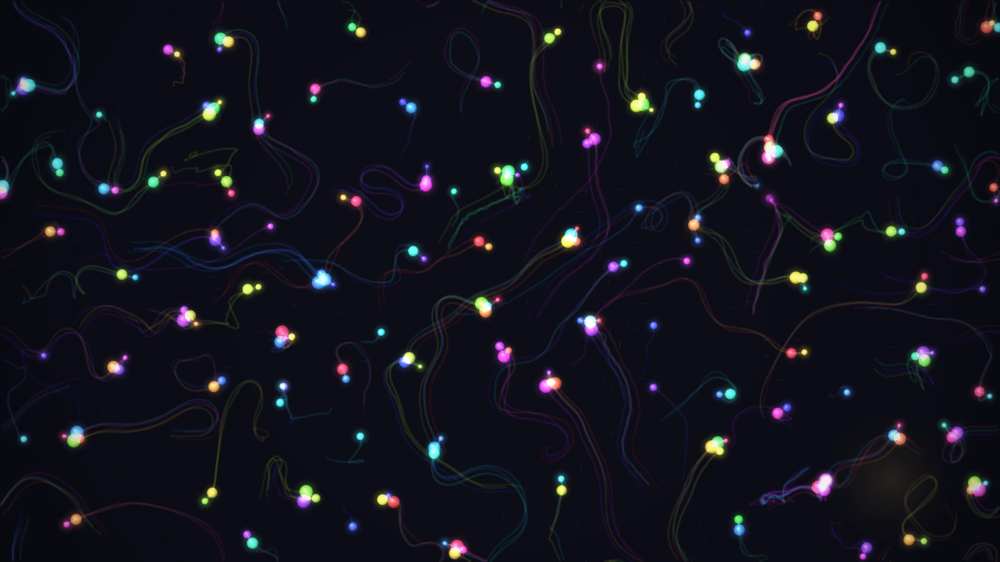
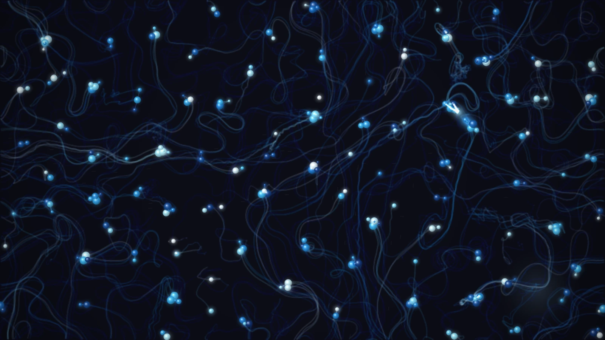
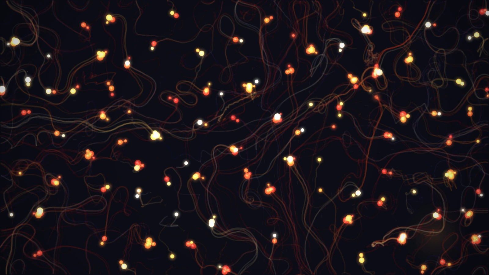
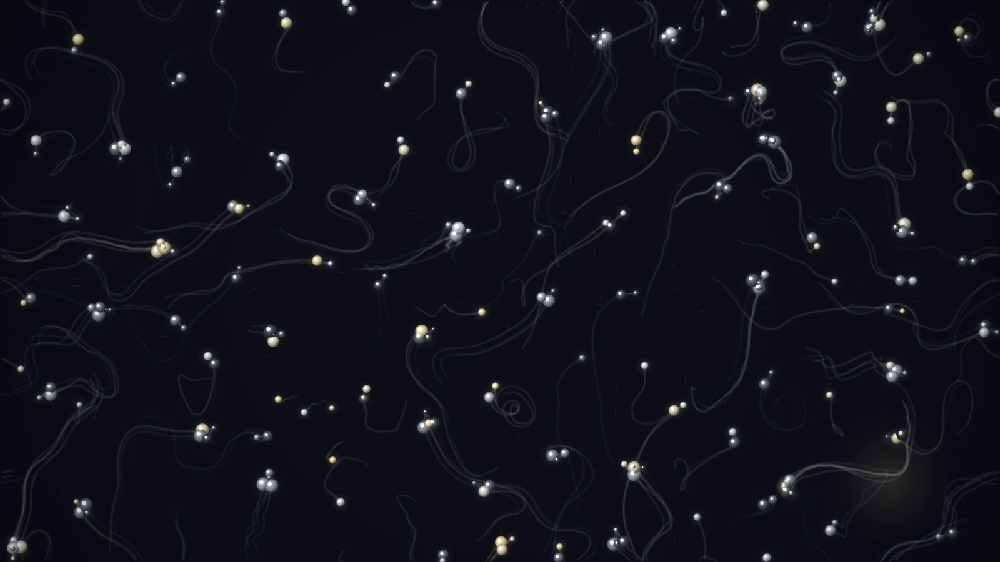

# Molequle

Molequle — an emergent art system. Bioluminescent entities that bond, form families, and leave trails.

Entities with continuous behavioral parameters move through a shared 1920x1080 canvas, form bonds, disrupt each other, reproduce, and die. The space accumulates a history of what's happened in it, and that history becomes a force that shapes future behavior. Color becomes biography — each entity's hue drifts over its lifetime based on what it's experienced.

| Bioluminescent | Ice |
|---|---|
|  |  |
| **Fire** | **Metallic** |
|  |  |

Close-ups: [bioluminescent](docs/screenshots/bioluminescent-detail.png) · [ice](docs/screenshots/ice-detail.png) · [fire](docs/screenshots/fire-detail.png) · [metallic](docs/screenshots/metallic-detail.png)

## Quick Start

Molequle runs entirely on your own machine: a small Node server plus the simulation in your browser. You need the whole project — clone it, or download **Source code (zip)** from the [latest release](https://github.com/TheFeloniousMonk/Molequle/releases/latest) and unzip it.

```bash
git clone https://github.com/TheFeloniousMonk/Molequle.git
cd Molequle/server
npm install
npm start
```

Open **http://localhost:3333** in your browser. The simulation starts automatically.

## Updating

1. Pull the latest code and restart the server (`Ctrl+C`, then `npm start` in `server/`). If the server isn't running in a terminal you can `Ctrl+C`, call `POST /api/flush` first so no trend history is lost.
2. In Claude Desktop, uninstall the Molequle extension and reinstall it from the new `molequle.mcpb`.
3. Hard-refresh the browser tab (`Ctrl+Shift+R` / `Cmd+Shift+R`) so it loads the new client code.

See [CHANGELOG.md](CHANGELOG.md) for what changed.

## Controls

### Keyboard
| Key | Action |
|-----|--------|
| Space | Pause / Resume |
| M | Toggle context map overlay |
| T | Toggle trails |
| S | Toggle The Smoother |
| R | Reset (same seed) |
| N | New run (random seed) |
| E | Cycle element (bioluminescent → ice → fire → metallic) |

### UI Panel
A mini-status bar in the header shows population, bonds, and current season at a glance. Click the gear icon to open the slide-out control panel, which contains collapsible accordion sections:
- **Status** — live population, bonds, parameter averages (S/I/V/B/D bars), tick, run time, seed, smoother state, weather conditions
- **Charts** — population over time and parameter distribution bars
- **Simulation** — speed slider, seed input, new run / reset buttons
- **Bonds** — bond radius, duration, rest distance, hardening, bonded floors
- **Disruption** — disruption threshold, radius, regen cap
- **Population** — spawn threshold, community/loneliness/crush thresholds, max population, max age
- **Weather** — season length/amplitude, current/bloom/storm parameters
- **Visual** — trail decay rate, light angle, context map half-life
- **Toggles** — element selector, 3D lighting, weather visuals, The Smoother, context map, trails, pause

## REST API

The server exposes a REST API for observing and controlling the simulation remotely.

### Read Endpoints
| Endpoint | Description |
|----------|-------------|
| `GET /api/state` | Current simulation snapshot (entities, config, context map) |
| `GET /api/events?since=TICK` | Event log (bonds, deaths, spawns, disruptions) |
| `GET /api/metrics` | Time series of population, bonds, and parameter averages |
| `GET /api/history` | Accumulated context map data |
| `GET /api/config` | Current configuration values |
| `GET /api/saves` | List of saved state files |
| `GET /api/load` | Load most recent saved state |
| `GET /api/param-ranges` | Tunable parameters with type, range or allowed values, and default |

### Write Endpoints
| Endpoint | Description |
|----------|-------------|
| `POST /api/params` | Queue parameter changes (e.g., `{"maxPopulation": 300}`) |
| `POST /api/control` | Send control commands (see below) |
| `POST /api/flush` | Save trend history and the weather log to disk now (call before stopping the server) |

### Control Commands
POST to `/api/control` with a JSON body:
```json
{"command": "pause"}
{"command": "resume"}
{"command": "reset"}
{"command": "new_run", "seed": 12345}
{"command": "smoother_on"}
{"command": "smoother_off"}
```

## How It Works

### Entities
Each entity has five behavioral parameters (all continuous 0-1):
- **Sociability** — attraction to others
- **Inertia** — resistance to movement (high = stationary + influential)
- **Volatility** — rate of parameter change (the meta-parameter)
- **Bond Affinity** — readiness to form connections
- **Disruption Charge** — how much the entity perturbs its surroundings

Parameters drift based on local conditions. There are no fixed types — behavioral profiles emerge and shift.

### Context Map
The space is divided into a grid. Each cell tracks bond formations, bond breaks, entity presence, and disruption events. This accumulated history creates terrain effects:
- **Fertile ground** — where bonds succeeded, bonding is easier
- **Scar tissue** — where bonds failed, volatility increases
- **Ghost trails** — echoes of old density attract social entities
- **Disruption zones** — volatile areas amplify chaos

### Visual Layer
Rendering is visual only: the look can be changed at any time without affecting the simulation.
- **Hue drift** — entities accumulate a color offset over their lifetime. Bond formation, bond loss, disruption exposure, and travel speed all shift an entity's hue. Two entities with identical parameters but different histories look different.
- **Elements** — the material entities are made of: *bioluminescent* (the original full-spectrum glow), *ice* (glassy, translucent navy → cyan → white), *fire* (glowing crimson → amber → yellow-white), *metallic* (gunmetal → silver → pale gold, sharp highlights). An entity's hue picks its place on the element's color ramp; volatility drives glow size, disruption charge drives glow intensity and highlight brightness. Bonds and trails are tinted to match. Press **E** or use the panel to switch.
- **Lighting** — faux-3D shading from one global light (`lightAngle`, default upper left): a highlight toward the light and a shadow crescent opposite. `lighting: "flat"` draws plain disks.
- **Size variance** — bonded entities render slightly larger. Newborns grow in over their first ~10 seconds.
- **Trails** — each entity leaves a fading ribbon on a lower-resolution trail layer. Family patrol patterns and migration routes become visible as underlayers; quiet regions fade fully back to the background.
- **Weather visuals** — storms dim and desaturate the entities inside them, with a cold rim and occasional lightning (plus frost sparkles, embers, or static sparks depending on the element); blooms are a warm upwelling glow; currents are drifting streaks; seasons shift a faint tint and vignette. Toggle with `showWeather`.
- **Performance** — entities are drawn from pre-rendered sprites (no per-frame blur or gradients), and the main canvas resolution follows `renderScale` (default: the display's pixel ratio, capped at 1.5).

### Weather
Seasonal cycles, migration currents, fertility blooms, and disruption storms add environmental pressure. Seasons modulate bond formation rates, movement speed, and disruption thresholds. Weather effects are tunable via the API.

### The Smoother
A toggleable rule that suppresses high-variance behavior. Disruption trends toward zero, volatility trends toward a baseline. The question: does suppressing variance produce stability or monoculture?

## Claude Desktop Extension (.mcpb)

A desktop extension lets Claude Desktop observe and control the simulation directly.

> **Local only.** The extension is a companion to the Molequle app, not a standalone or remote MCP server. It talks to the Molequle server from this project running on your machine (default `http://localhost:3333`), and does nothing on its own. Set up the project first ([Quick Start](#quick-start)), start the server, and open the simulation in your browser.

### Install

1. Follow the [Quick Start](#quick-start) and keep the server running.
2. Double-click `molequle.mcpb` (in the project root, or attached to the [latest release](https://github.com/TheFeloniousMonk/Molequle/releases/latest)) to install in Claude Desktop. It will prompt for the server URL (default: `http://localhost:3333`).

### Rebuild from Source

```bash
cd mcp
pip install --target lib mcp httpx
npx @anthropic-ai/mcpb pack . ../molequle.mcpb
```

### Available Tools

| Tool | Description |
|------|-------------|
| `molequle_get_state` | Get simulation snapshot (summary, full, or entities only) |
| `molequle_get_events` | Get event log with filtering by type and tick range |
| `molequle_get_metrics` | Get time-series data (population, params, terrain stats) |
| `molequle_get_history` | Get context map — the spatial memory of the simulation |
| `molequle_get_config` | Get current configuration values |
| `molequle_set_params` | Adjust simulation parameters remotely |
| `molequle_control` | Pause, resume, reset, toggle smoother, start new run |
| `molequle_list_saves` | List saved state files |

The Molequle server must be running for the MCP tools to work.

## ChatGPT Desktop (Community Plugin)

ChatGPT users can connect through [molequle-chatgpt](https://github.com/Anonymous-Therapist/molequle-chatgpt), a community-contributed plugin by [@Anonymous-Therapist](https://github.com/Anonymous-Therapist). It packages Molequle's Python MCP bridge as a local ChatGPT Desktop/Codex plugin with the same observe-and-control tools. Like the Claude extension, it's local only: run this project and keep the simulation open in your browser. See that repo for install steps.

It's maintained separately from Molequle, so please report issues with it on its own repo.

## State Persistence
The simulation auto-saves every ~50 seconds, and immediately when a new run starts. On reload, it resumes from the last saved state, including visual settings. State files are stored in `server/data/`; their names include the run's seed.

Trend history (`trends.json`) and the weather log (`weather-log.json`) are saved every 5 minutes when they have new data, on `POST /api/flush`, and on a graceful shutdown (`Ctrl+C`).

The same seed and config reproduce the same world within one JavaScript engine. Browsers can differ in the last bit of some math functions (`Math.sin`, `Math.log`, ...), and the simulation amplifies that, so the same seed can grow a different world in a different browser.

## Project Structure
```
emergent-system/
  server/
    index.js          Express server + REST API
    package.json
    data/             Saved state files
  client/
    index.html
    css/style.css
    js/
      main.js         Entry point, animation loop, orchestration
      params.js       Config defaults + tunable param ranges (shared with server)
      entity.js       Entity class with parameters and behavior
      context-map.js  Accumulated history grid
      renderer.js     Canvas rendering: frame composition, trails, bonds, entities
      sprites.js      Pre-rendered entity sprite atlases (glow, lit body, highlight)
      elements.js     Element materials: color ramps and lighting properties
      weather-fx.js   Weather visuals (storm, bloom, current, season effects)
      events.js       Event logging and server communication
      ui.js           Control panel, sliders, charts
      weather.js      Seasonal cycles, currents, blooms, storms
      prng.js         Seeded random number generator
  mcp/
    manifest.json     MCPB extension manifest
    server/main.py    Python MCP server (FastMCP)
    requirements.txt
    lib/              Bundled Python dependencies
  molequle.mcpb       Packaged desktop extension
  docs/screenshots/   Element screenshots
  CHANGELOG.md
```

## License

MIT
